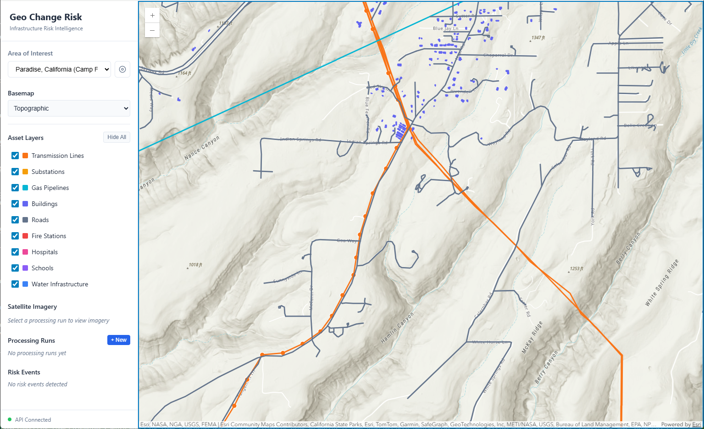
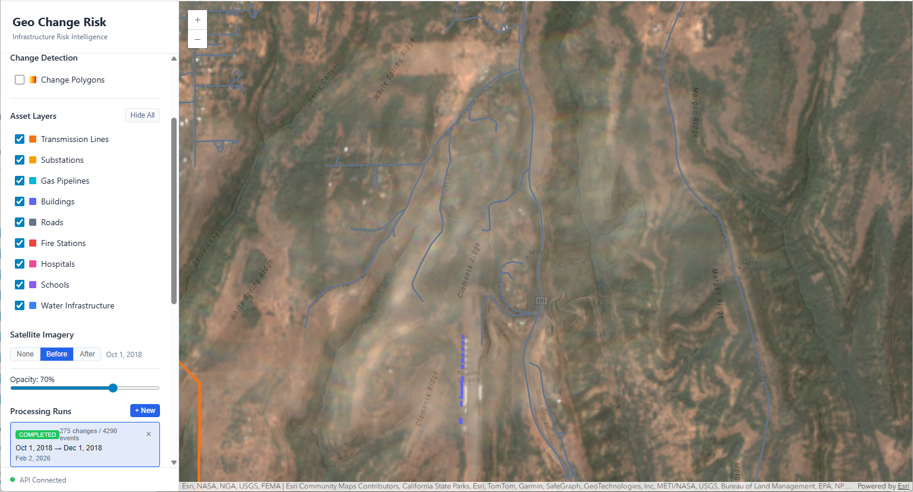
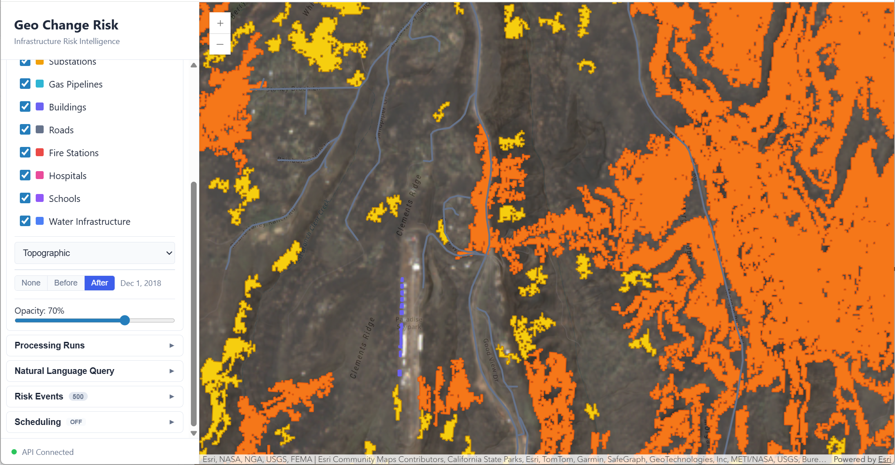
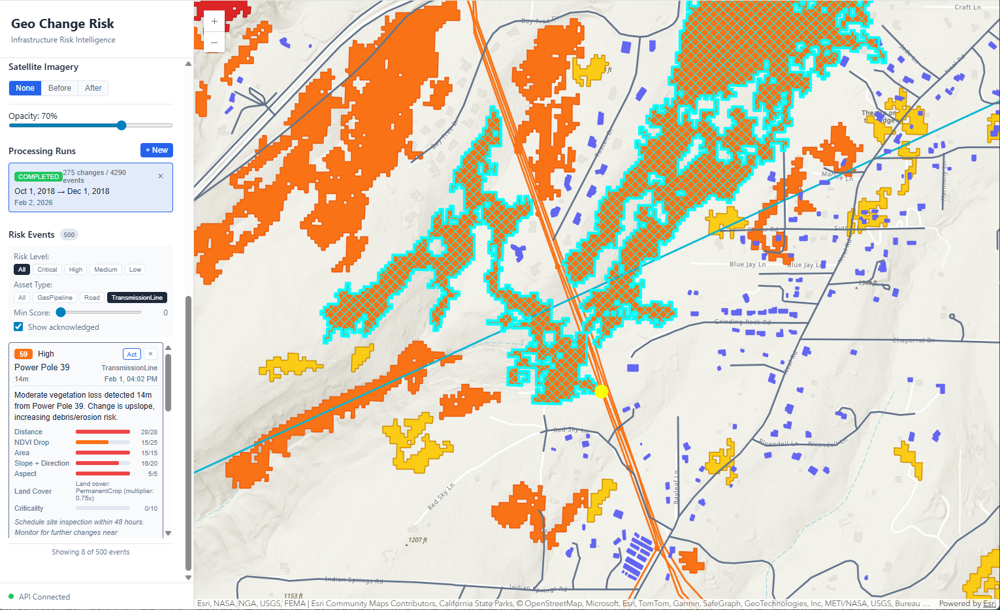
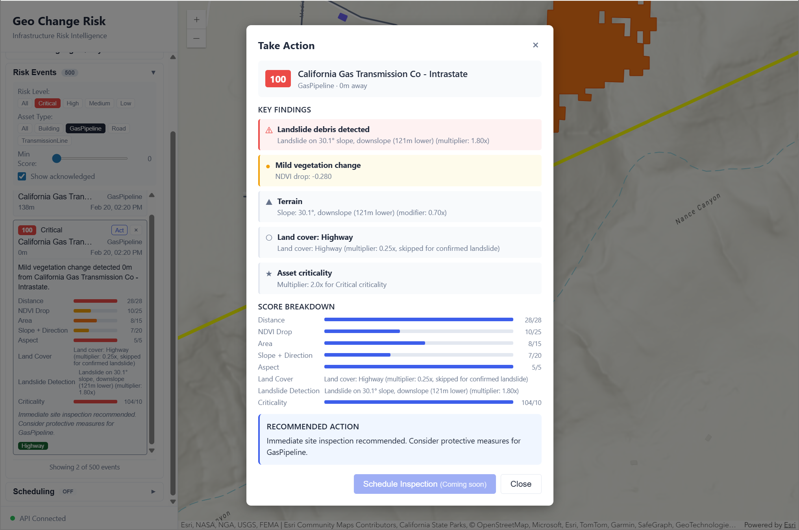
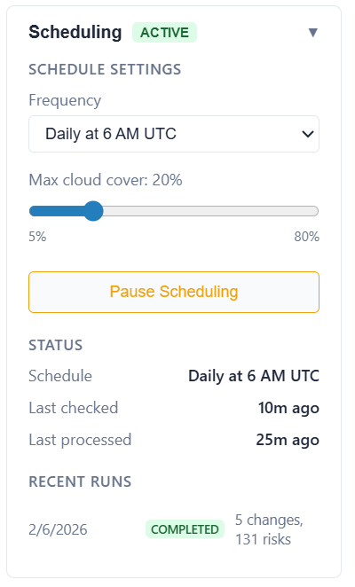

# Geo Change Risk Platform

Geospatial risk intelligence for critical infrastructure. Detects land-surface changes from satellite imagery, scores threat severity using terrain and proximity analysis, and delivers actionable risk events to asset operators.

*End-to-end geospatial engineering — satellite data pipelines, spatial analysis, ML classification, and full-stack cloud architecture.*

## Screenshots

### Asset Map


*Interactive map displaying assets to be monitored within a specified area of interest.*

### Processing Run Dashboard


*Processing run management showing pipeline status, change polygon counts, and risk event summaries.*

### Before/After Imagery Comparison


*Sentinel-2 imagery showing vegetation state before detected change event.*



*Sentinel-2 imagery showing vegetation state after detected change event (in this case, the 2018 Camp fire) with detected change polygons.*

### Risk Event Detail Panel


*Detailed risk event displayed on map with explainable score breakdown showing individual factor contributions, in this case including a possible landslide event detected using the custom trained ML model.*



*Risk event alert with actionable instructions (can be integrated into a site inspection scheduling system).*

### Automated Scheduling


*Scheduling panel with configurable frequency, cloud cover threshold, and job history showing automated processing runs.*


## Why This Exists

Wildfires, landslides, and other land-surface changes threaten critical infrastructure — power lines, substations, hospitals, schools, and transportation corridors. The organizations responsible for these assets (electric utilities, pipeline operators, transportation agencies, emergency managers) typically learn about threats reactively, after damage has occurred or during costly manual inspections.

This platform turns freely available satellite data into **continuous, automated risk monitoring**:

1. **Sentinel-2 imagery** (ESA, 5-day revisit) provides regular snapshots of vegetation health across any area of interest
2. **NDVI change detection** identifies where and how severely vegetation has been lost or altered
3. **Terrain modeling** (USGS 3DEP elevation data) determines whether changes are upslope of assets — a critical factor for debris flow and fire spread risk
4. **ML land cover classification** (EuroSAT via TorchGeo) distinguishes high-risk events like forest fires from routine changes like crop harvests, reducing false positives
5. **ML landslide detection** (custom U-Net trained on Landslide4Sense) identifies debris flows on steep terrain — a critical correlated hazard after wildfire
6. **Multi-factor risk scoring** produces a 0-100 score with full explainability — operators can see exactly why an event was flagged and what factors contributed

The result is a prioritized feed of risk events that tells an asset operator: *"This specific vegetation loss, 200 meters upslope of your substation on a 30-degree slope, has a risk score of 82 (Critical) — here's the before/after imagery."*

## Key Features

- **Satellite Change Detection** — Automated NDVI change detection from Sentinel-2 imagery via Microsoft Planetary Computer STAC API
- **Automated Scheduling** — Per-AOI cron-based scheduling with configurable cloud cover thresholds. Automatically checks for new imagery and triggers processing runs when acceptable data is available
- **Terrain-Aware Scoring** — USGS 3DEP elevation data powers slope, aspect, and directional risk analysis (upslope threats score higher)
- **Asset Proximity Analysis** — PostGIS spatial queries calculate distances between detected changes and infrastructure assets
- **ML Land Cover Context** — EuroSAT pretrained model (via TorchGeo) classifies land cover to weight risk appropriately (forest fire vs. crop harvest)
- **ML Landslide Detection** — Custom U-Net segmentation model trained on Landslide4Sense dataset identifies debris flows in steep terrain from 14-channel satellite + elevation input
- **Explainable Risk Scores** — Every score includes a full breakdown of contributing factors and their individual weights
- **Interactive Map UI** — ArcGIS Maps SDK with before/after imagery comparison, layer controls, and risk event exploration
- **Dismiss/Act Workflow** — Risk events support operational triage with dismiss and action tracking

## Technology Stack

| Layer | Technology | Purpose |
|-------|------------|---------|
| **Database** | PostgreSQL + PostGIS | Spatial data storage and queries |
| **Object Storage** | MinIO (local) / S3 (AWS) | Raster imagery and processing artifacts |
| **API** | ASP.NET Core 8 | REST API with EF Core + NetTopologySuite |
| **Raster Pipeline** | Python 3.11+ | Geospatial processing (rasterio, geopandas, pystac) |
| **Web UI** | SvelteKit + ArcGIS Maps SDK + D3.js | Interactive mapping, visualization, and data graphics |
| **Background Jobs** | Hangfire (local) / EventBridge (AWS) | Scheduled processing and notifications |
| **Cloud Deployment** | Terraform + AWS (App Runner, ECS Fargate, RDS, S3, CloudFront) | Production cloud infrastructure |
| **ML Classification** | PyTorch + TorchGeo | Land cover classification (EuroSAT) |
| **ML Segmentation** | PyTorch + segmentation-models-pytorch | Landslide detection (custom-trained U-Net) |

## Architecture

```
┌─────────────────────────────────────────────────────────────────────────┐
│                              Web UI (SvelteKit)                         │
│                     ArcGIS Maps SDK + Interactive Panels                │
└────────────────────────────────────┬────────────────────────────────────┘
                                     │
                                     ▼
┌─────────────────────────────────────────────────────────────────────────┐
│                           REST API (.NET 8)                             │
│              Areas of Interest │ Assets │ Processing │ Risk Events      │
└───────────┬─────────────────────────────────────────────┬───────────────┘
            │                                             │
            ▼                                             ▼
┌───────────────────────┐                   ┌─────────────────────────────┐
│  PostgreSQL/PostGIS   │                   │    Python Raster Pipeline   │
│  - AOIs & Assets      │                   │    - STAC Search            │
│  - Processing Runs    │◄──────────────────│    - NDVI Calculation       │
│  - Change Polygons    │                   │    - Change Detection       │
│  - Risk Events        │                   │    - Terrain Analysis       │
└───────────────────────┘                   │    - ML Land Cover          │
                                            │    - ML Landslide Detection │
                                            │    - Risk Scoring           │
                                            └──────────────┬──────────────┘
                                                           │
                                                           ▼
                                            ┌─────────────────────────────┐
                                            │     MinIO Object Storage    │
                                            │     - Satellite Imagery     │
                                            │     - NDVI Rasters          │
                                            │     - DEM Tiles             │
                                            └─────────────────────────────┘
```

## Risk Scoring Model

The platform uses a multi-factor risk scoring model (0-100 scale):

| Factor | Weight | Description |
|--------|--------|-------------|
| **Distance** | 28 pts | Proximity of change to asset (<100m = max score) |
| **NDVI Drop** | 25 pts | Severity of vegetation loss (more negative = higher risk) |
| **Area** | 15 pts | Size of change polygon |
| **Slope + Direction** | 20 pts | Terrain steepness; upslope (landslide/debris risk) 1.5-2.5x, downslope (fire risk) 0.7-0.9x |
| **Aspect** | 5 pts | South-facing slopes = higher fire risk |
| **Land Cover** | multiplier | ML-classified context: Forest=1.0x, Crop=0.3x, Highway=0.25x (requires `[ml]` deps) |
| **Landslide** | multiplier | ML-detected debris on steep terrain: 1.8x base, +0.5x if upslope, capped at 2.5x |
| **Asset Criticality** | multiplier | Critical assets (hospitals, substations) get 2x weight |

**Risk Levels:** Critical (75-100), High (50-74), Medium (25-49), Low (0-24)

## Architecture Decisions

- **Multi-process separation of concerns** — .NET handles API orchestration, auth, and job scheduling while Python handles heavy geospatial processing. Each stack uses its strongest ecosystem (EF Core + PostGIS for spatial CRUD, rasterio + numpy for raster math) rather than forcing one language to do everything.
- **Explainable scoring over black-box classification** — Every risk score includes a full factor breakdown so operators can understand *why* an event was flagged, not just that it was. This is essential for operational trust and regulatory defensibility.
- **Graceful ML degradation** — PyTorch and TorchGeo are optional dependencies. The pipeline produces useful risk scores without ML; land cover classification and landslide detection enhance accuracy when available but never block the core workflow.
- **Additive scoring with multipliers** — Base factors (distance, NDVI drop, area, slope, aspect) are additive and auditable. Context multipliers (land cover, asset criticality, landslide) scale the result. This makes the model transparent and tunable without requiring retraining.
- **PostGIS spatial indexing for proximity queries** — GIST indexes on geometries enable fast nearest-asset lookups across thousands of infrastructure features, keeping risk scoring performant as asset counts grow.

## Project Structure

```
geo-change-risk/
├── src/
│   ├── api/                    # .NET 8 REST API
│   │   ├── GeoChangeRisk.Api/      # Controllers, services, jobs
│   │   ├── GeoChangeRisk.Data/     # EF Core models, migrations
│   │   └── GeoChangeRisk.Contracts/ # DTOs and shared types
│   ├── pipeline/               # Python raster processing
│   │   └── georisk/               # CLI and processing modules
│   └── web-ui/                 # SvelteKit frontend
├── areas-of-interest/          # AOI configurations and data scripts
│   └── paradise/                  # Paradise, CA (Camp Fire area)
├── infra/                      # Infrastructure configuration
│   └── local/                     # Docker Compose, env templates
├── deployments/                # Deployment scripts
│   ├── local/                     # Local development setup
│   ├── aws/                       # AWS deployment (Terraform + deploy script)
│   └── azure/                     # Azure deployment (planned)
├── machine-learning/           # ML model training
│   └── landslide/                 # U-Net landslide segmentation (training pipeline)
└── docs/                       # Documentation
```

## Getting Started

### Prerequisites

- Docker Desktop
- .NET 8 SDK
- Python 3.11+
- Node.js 18+

### Quick Start

**Windows (PowerShell):**
```powershell
.\deployments\local\setup.ps1
```

**Linux/Mac:**
```bash
chmod +x deployments/local/setup.sh
./deployments/local/setup.sh
```

This will:
1. Generate random credentials for local development
2. Start PostgreSQL/PostGIS and MinIO containers
3. Initialize MinIO buckets
4. Display your credentials at the end

Credentials are stored in `infra/local/.env` (gitignored).

### Initialize Sample Data (Paradise, CA)

```bash
cd areas-of-interest/paradise
pip install -r requirements.txt
python download-assets.py
python initialize.py
```

### Start the Application

```bash
# Terminal 1: Start API
cd src/api/GeoChangeRisk.Api
dotnet run
# To run w/ log file: dotnet run 2>&1 | Tee-Object -FilePath "api-output.txt"

# Terminal 2: Start Web UI
cd src/web-ui
npm install
npm run dev
```

Open http://localhost:5173 to view the application.

### Run Change Detection

```bash
cd src/pipeline
pip install -e ".[ml]"   # includes ML land cover classification
# Or: pip install -e .   # base pipeline without ML

# Search for available imagery
python -m georisk search --aoi-id paradise-ca --date-range 2018-01-01/2018-12-31

# Run change detection (before/after Camp Fire)
python -m georisk process --aoi-id paradise-ca --before 2018-10-01 --after 2018-12-01
```

## Sample Area of Interest: Paradise, CA

The included Paradise AOI covers the 2018 Camp Fire area with ~3,900 infrastructure assets:

- **Buildings:** 1,420 structures from OpenStreetMap
- **Roads:** 2,354 road segments
- **Power Infrastructure:** 117 power features + 6 CEC transmission lines
- **Emergency Services:** 6 fire stations, 11 schools

## Current Status

| Component | Status | Description |
|-----------|--------|-------------|
| Infrastructure | Complete | Docker Compose, PostgreSQL/PostGIS, MinIO |
| REST API | Complete | Full CRUD for AOIs, assets, processing runs, risk events |
| Web UI | Complete | Interactive map, before/after imagery, risk event triage |
| Raster Pipeline | Complete | STAC search, NDVI change detection, vectorization |
| Terrain Analysis | Complete | USGS 3DEP slope/aspect/elevation, directional scoring |
| Risk Scoring | Complete | Multi-factor additive scoring with land cover and criticality multipliers |
| ML Land Cover | Complete | EuroSAT classification via TorchGeo (optional `[ml]` dependency) |
| ML Landslide Detection | Complete | Custom U-Net trained on Landslide4Sense, integrated into pipeline and risk scoring |
| Automated Scheduling | Complete | Per-AOI cron scheduling, cloud cover thresholds, `georisk check` CLI, Hangfire recurring jobs, Web UI scheduling panel |
| Testing | Complete | xUnit (.NET API controllers, services, models) + pytest (Python pipeline raster processing, risk scoring) |
| AWS Deployment | Complete | App Runner (API), ECS Fargate Spot (pipeline), RDS PostgreSQL, S3, CloudFront, EventBridge Scheduler, Terraform IaC |

## Automated Scheduling

The platform supports fully automated monitoring of each AOI for new satellite imagery. When configured, a Hangfire recurring job checks for new Sentinel-2 scenes on a cron schedule and automatically triggers processing runs when acceptable data is available.

### How It Works

1. **Schedule configuration** — Each AOI can be assigned a cron schedule (e.g., daily, weekly) and a maximum cloud cover threshold via the Scheduling panel in the Web UI or the REST API
2. **Imagery check** — On each scheduled tick, the `georisk check` CLI command queries the STAC API for new Sentinel-2 scenes since the last completed run, filtered by the cloud cover threshold
3. **Automatic run creation** — If a new scene is found that hasn't been processed yet, a processing run is created with:
   - **After date** = the date of the new scene
   - **Before date** = the after date from the last completed run (creating a continuous monitoring chain), or `defaultLookbackDays` back from the new scene if no previous run exists
4. **Guard logic** — If a processing run is already in progress for the AOI, the check skips to avoid duplicate runs
5. **Persistence** — Schedules are stored on the AOI record in the database and re-registered with Hangfire on API startup

### CLI Usage

```bash
# Check for new imagery (used by scheduler, also available manually)
python -m georisk check --aoi-id paradise-ca --json

# With custom cloud cover threshold
python -m georisk check --aoi-id paradise-ca --max-cloud 15 --json
```

### API Usage

```bash
# Configure a daily schedule at 6 AM UTC with 25% max cloud cover
curl -X PUT http://localhost:5074/api/areas-of-interest/paradise-ca/schedule \
  -H "Content-Type: application/json" \
  -d '{"processingSchedule": "0 6 * * *", "processingEnabled": true, "maxCloudCover": 25}'
```

### Common Cron Schedules

| Schedule | Cron Expression |
|----------|----------------|
| Every 6 hours | `0 */6 * * *` |
| Daily at 6 AM UTC | `0 6 * * *` |
| Twice weekly (Mon/Thu) | `0 6 * * 1,4` |
| Weekly (Monday) | `0 6 * * 1` |

## ArcGIS Pro Integration (Optional)

Optional read-only PostGIS views (`v_areas_of_interest`, `v_asset_*`, `v_change_polygons`, `v_risk_events`) can be installed for direct use in ArcGIS Pro. The views are not created automatically — run `infra/local/optional/arcgis-views.sql` manually after EF Core migrations. See [docs/arcgis-pro-setup.md](docs/arcgis-pro-setup.md) for setup instructions.

### Cloud Deployment

The platform deploys to AWS with a single script. See [docs/aws-deployment.md](docs/aws-deployment.md) for the full deployment guide.

```powershell
.\deployments\aws\scripts\deploy.ps1
```

Architecture: App Runner (scale-to-zero API, ~$2/month idle) + ECS Fargate Spot (on-demand pipeline) + RDS PostgreSQL + S3 + CloudFront + EventBridge Scheduler + VPC Endpoints. Estimated ~$47/month total.

The architecture is multi-cloud portable via three DI-swappable interfaces (`IObjectStorageService`, `ISchedulerService`, `IPipelineExecutor`). See [docs/multi-cloud-strategy.md](docs/multi-cloud-strategy.md) for Azure and GCP deployment paths.

## Roadmap

## Machine Learning

The platform uses two ML models that integrate into the pipeline as optional dependencies — the pipeline degrades gracefully without them.

### Land Cover Classification (EuroSAT)

Pretrained EuroSAT model (via TorchGeo) classifies the land cover around each change polygon. This provides context for risk scoring: a vegetation loss event in forest land (1.0x) is treated very differently from one on agricultural land (0.3x) where seasonal clearing is routine.

### Landslide Detection (Custom U-Net)

A U-Net segmentation model trained in-house on the [Landslide4Sense](https://github.com/iarai/Landslide4Sense-2022) dataset to detect landslide debris in satellite imagery. Post-fire terrain loses the root systems that stabilize slopes, making debris flow a critical correlated hazard for downstream infrastructure.

**Training pipeline** (`machine-learning/landslide/`):
- **Architecture:** U-Net with ResNet34 encoder (via segmentation-models-pytorch), pretrained on ImageNet and adapted to 14-channel input
- **Dataset:** Landslide4Sense — 3,799 training patches of 128x128 pixels, each with 12 Sentinel-2 spectral bands + slope + DEM elevation, with binary landslide masks
- **Training approach:** Combined Dice + BCE loss with class imbalance handling (pos_weight capping), AdamW optimizer, cosine LR scheduling, mixed-precision training, early stopping on validation IoU
- **Results:** IoU 0.47, F1 0.56, Recall 0.78 — achieves significantly higher recall than the [official competition baseline](https://github.com/iarai/Landslide4Sense-2022) (0.78 vs. 0.66) at comparable F1, prioritizing detection completeness over precision for a safety-critical application. Full training logs and hyperparameter search across 8 runs documented in [`TRAINING.md`](machine-learning/landslide/TRAINING.md)

**Inference integration** (`src/pipeline/georisk/raster/landslide.py`):
- Assembles 14-channel input patches from data the pipeline already produces (Sentinel-2 bands + USGS 3DEP terrain)
- Only evaluates polygons on steep terrain (slope > 10°) to focus on plausible landslide locations
- Dual classification criteria (mean probability + pixel fraction thresholds) to control false positive rate
- Classified landslide polygons receive a 1.8x-2.5x risk score multiplier, stacking with directional slope factors

**Model storage:** The trained model (~94 MB) is stored in the `ml-models` S3/MinIO bucket (not in git). The pipeline auto-downloads it to `~/.cache/georisk/models/` on first use. Upload with `georisk model upload <path>`, or train your own following [`TRAINING.md`](machine-learning/landslide/TRAINING.md).

## Contact

Questions, feedback, or want to see a live demo? Reach out at rob@izzystu.com — I'd love to chat.

## License

This project is licensed under the [MIT License](LICENSE).
